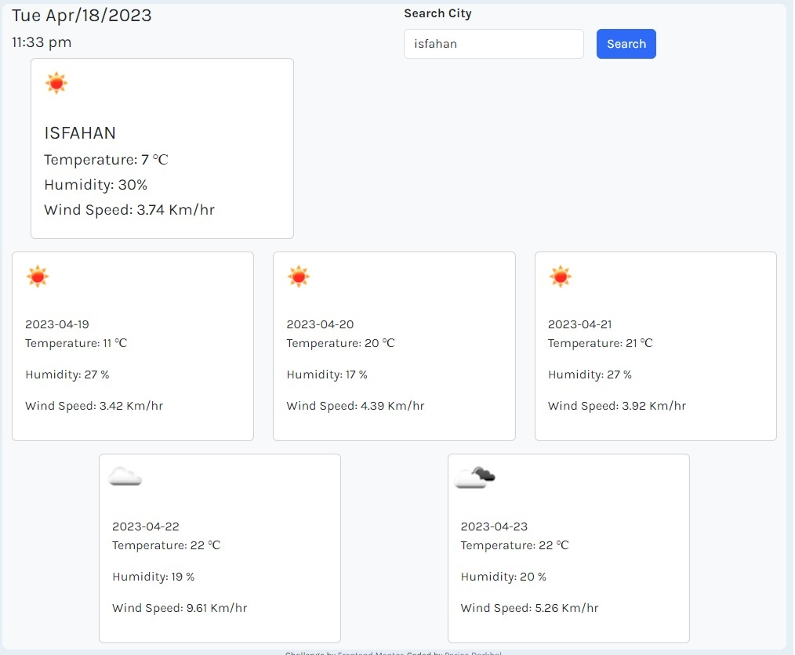

# Weather-Dashboard

This is a web application that provides weather information of a city for the current day and forecast for the next 5 days. It uses the third-party API provided by Openweathermap.org to get the weather data and day.js to handle date and time.

### [Visit Page](https://parisadarkhal.github.io/Weather-Dashboard/)

---

## Features

The following weather items are displayed on the dashboard:

1. Weather status (as an icon)
2. Temperature (in Celsius)
3. Humidity (in %)
4. Wind Speed (in km/hr)

---

## APIs

This application uses the following APIs:

- Openweathermap API - for weather data
- Day.js - for handling date and time

---

## Mock-Up

---

## License

This project is licensed under the MIT License - see the LICENSE file for details.
